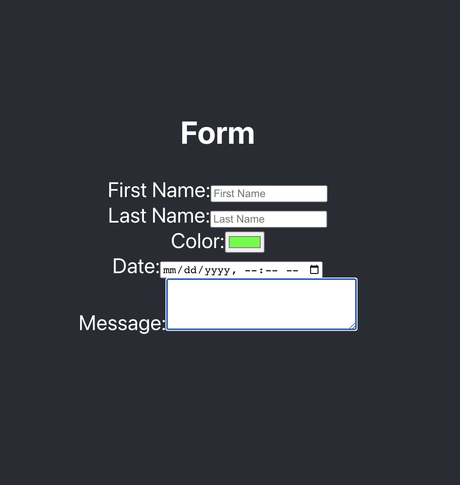

# Form Practice -react.js App
Building a React app with onchange funtionality for an HTML form for BocaCode C-10 in class practice.

[](https://form-practice-jch.web.app/)

# Demo Link
[See Demo](https://form-practice-jch.web.app)

## Covered In Class
* onChange
* Form Elements
* Controlled Elements

## Basic Code
```
<label>First Name:
<inout type="text">
<label/>
```
